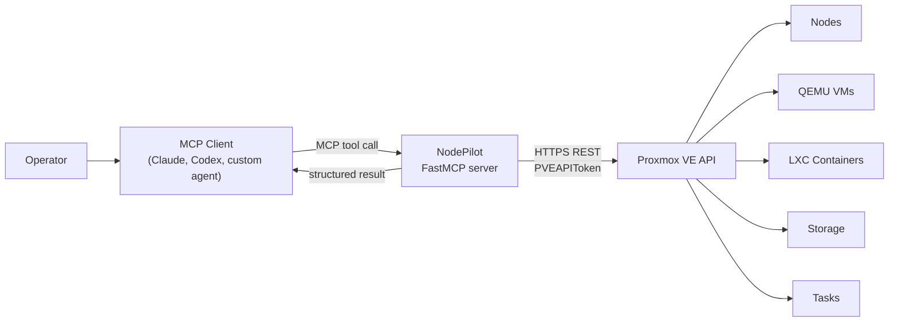
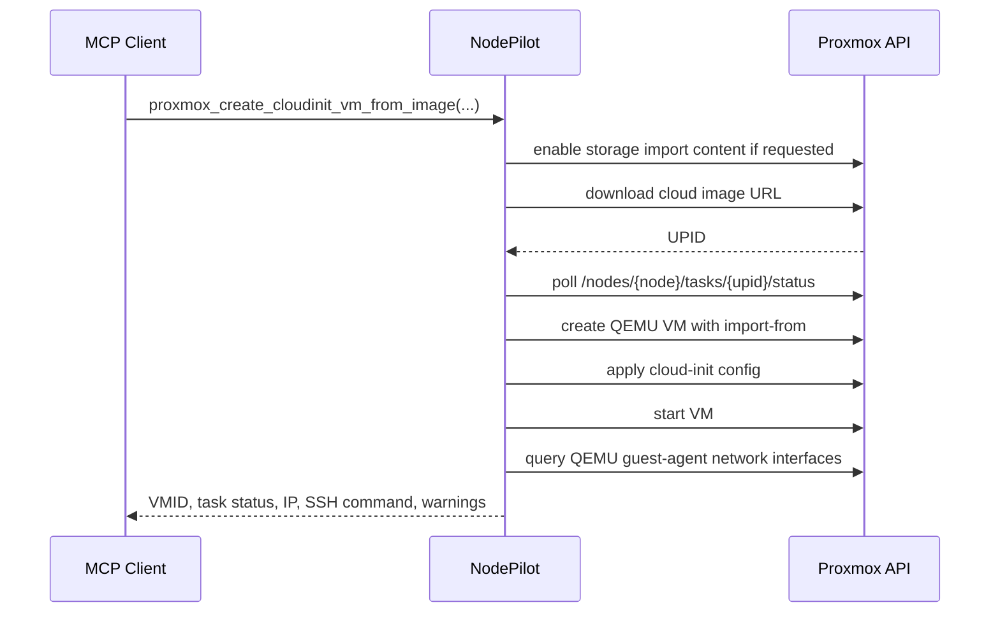

# NodePilot

AI-assisted operations for Proxmox VE through the Model Context Protocol.

NodePilot is a Python MCP server that exposes Proxmox VE inventory, QEMU VM, LXC container,
storage, task, service, network, firewall, apt, snapshot, backup, and raw API operations to MCP
clients.

## What NodePilot Can Do

- Inspect Proxmox nodes, cluster resources, guests, storage, tasks, services, network interfaces,
  firewall rules, and apt updates.
- Create, clone, configure, start, stop, reboot, snapshot, roll back, back up, and delete QEMU VMs.
- Create, configure, start, stop, reboot, snapshot, roll back, back up, and delete LXC containers.
- Download ISO images, LXC templates, and cloud disk images into Proxmox storage.
- Build cloud-init VMs from existing templates or directly from cloud image URLs.
- Call raw Proxmox API endpoints through `proxmox_api_request` when a curated tool does not exist.

## Safety

NodePilot can expose destructive Proxmox operations, including guest deletion, guest power actions,
snapshot rollback, storage deletion, service actions, and raw Proxmox API calls. Run it only in a
trusted environment and use an MCP client that shows tool-call approval prompts for high-risk
operations.

Recommended public deployment posture:

- Run NodePilot on a trusted workstation or internal automation host.
- Keep `.env` local and never commit API token values.
- Use a dedicated Proxmox API token with only the permissions you need.
- Avoid exposing the HTTP transport to untrusted networks.
- Rotate the token if it is ever pasted into chat, logs, screenshots, or source control.

## How It Works

NodePilot runs locally or on an internal automation host. MCP clients talk to NodePilot over stdio
or Streamable HTTP. NodePilot then calls the Proxmox VE HTTPS API using a Proxmox API token.



Long-running Proxmox operations return UPIDs. NodePilot polls the task endpoint and returns the
completed status to the MCP client.



## Requirements

- Python 3.11+
- [`uv`](https://docs.astral.sh/uv/)
- Proxmox VE reachable over HTTPS
- A Proxmox API token with permissions for the tools you plan to use

## Setup

Install dependencies:

```bash
uv sync
```

Create a dedicated Proxmox user and API token. Adjust privileges for your environment; the example
below intentionally leaves ACL assignment to the operator:

```bash
pveum user add nodepilot@pve
pveum user token add nodepilot@pve mcp -comment "NodePilot MCP token"
```

Grant the token only the privileges needed for your intended workflow. Read-only inventory use can
be scoped much more tightly than VM/container creation or raw API control.

Copy `.env.example` to `.env` and set the token value. Proxmox shows the token secret only once.

```text
PROXMOX_API_URL=https://proxmox.example.local:8006/api2/json
PROXMOX_USER=nodepilot@pve
PROXMOX_TOKEN_NAME=mcp
PROXMOX_TOKEN_VALUE=placeholder
PROXMOX_DEFAULT_NODE=pve-node-1
PROXMOX_VERIFY_SSL=false
```

Set `PROXMOX_VERIFY_SSL=true` when your Proxmox host has a certificate trusted by the machine
running NodePilot.

## Running NodePilot

Default stdio MCP transport:

```bash
uv run nodepilot
```

Streamable HTTP:

```bash
MCP_HTTP_HOST=127.0.0.1 MCP_HTTP_PORT=8000 uv run nodepilot --transport streamable-http
```

Then connect an MCP client to:

```text
http://127.0.0.1:8000/mcp
```

## Example Client Config

For a stdio MCP client:

```json
{
  "mcpServers": {
    "proxmox": {
      "command": "uv",
      "args": [
        "--directory",
        "/path/to/nodepilot",
        "run",
        "nodepilot"
      ]
    }
  }
}
```

For local development, replace `/path/to/nodepilot` with the absolute path to your checkout.

Read-only test prompt:

```text
Use the proxmox MCP server to list Proxmox nodes and show each node name and status.
```

Approve read-only tools such as `proxmox_list_nodes`, `proxmox_list_guests`,
`proxmox_list_storage`, `proxmox_list_isos`, and `proxmox_node_status`. Review destructive tools
carefully before approving them.

## Tool Coverage

NodePilot includes curated tools for common operations and `proxmox_api_request` for Proxmox
endpoints not yet wrapped by a first-class tool.

### Storage

```text
proxmox_list_storage
proxmox_get_storage_config
proxmox_ensure_storage_content
proxmox_list_storage_content
proxmox_list_isos
proxmox_list_backups
proxmox_list_storage_templates
proxmox_download_url_to_storage
proxmox_download_ct_template_url
proxmox_download_iso_url
proxmox_download_cloud_image_url
```

Cloud disk images are different from installer ISOs. Use `proxmox_download_cloud_image_url` or
`proxmox_create_cloudinit_vm_from_image` for `.img`/`.qcow2` cloud images. The storage receiving
the cloud image must allow Proxmox `import` content. `proxmox_ensure_storage_content` can add that
content type to a storage such as `local`.

### LXC Containers

```text
proxmox_validate_lxc_config
proxmox_create_container
proxmox_delete_container
proxmox_container_power
```

Proxmox restricts some LXC feature flags to the exact `root@pam` account. When creating containers
through an API token, NodePilot preserves token-safe `nesting=1` and returns warnings for skipped
flags such as `keyctl=1`, `mknod=1`, `fuse=1`, `mount=...`, and `force_rw_sys=1`.

### Cloud-Init VMs

```text
proxmox_create_cloudinit_vm
proxmox_create_cloudinit_vm_from_image
```

`proxmox_create_cloudinit_vm` clones an existing QEMU cloud-init template, applies common Proxmox
cloud-init settings, optionally starts the VM, waits for a QEMU guest-agent IP, and can run package
installs or shell commands through QEMU guest agent.

`proxmox_create_cloudinit_vm_from_image` handles the no-template case. It can enable `import`
content on image storage, download an external cloud image URL, create the VM using Proxmox
`import-from`, attach a cloud-init drive, then run the same ready-for-SSH workflow.

Example:

```json
{
  "image_url": "https://cloud-images.ubuntu.com/noble/current/noble-server-cloudimg-amd64.img",
  "name": "ubuntu-dev",
  "user": "demo",
  "ssh_public_key": "ssh-ed25519 AAAA...",
  "image_storage": "local",
  "vm_storage": "local-lvm",
  "memory": 4096,
  "cores": 2,
  "disk_gb": 40,
  "packages": ["openssh-server", "qemu-guest-agent", "curl", "git"],
  "start": true,
  "wait_for_ip": true
}
```

Successful responses include the VMID, IP address when reported by guest agent, and an SSH command
such as `ssh demo@10.0.0.55`.

### Raw API

Useful raw API examples:

```json
{"method": "GET", "path": "/version"}
{"method": "GET", "path": "/cluster/resources"}
{"method": "POST", "path": "/nodes/pve-node-1/qemu/100/status/shutdown"}
{"method": "DELETE", "path": "/nodes/pve-node-1/qemu/128", "params": {"purge": true}}
```

Use `proxmox_api_request` carefully. It exists so the full Proxmox API remains reachable, but it
can bypass the intent and guardrails of curated tools.

## Development

Run the local MCP server:

```bash
uv run nodepilot
```

List tools with an MCP inspector/client, then start with read-only tools before testing mutating
workflows.

## Tests

```bash
uv run ruff check .
uv run pytest
```

Read-only live smoke tests are opt-in:

```bash
PROXMOX_RUN_LIVE_TESTS=1 uv run pytest tests/test_live_smoke.py
```
